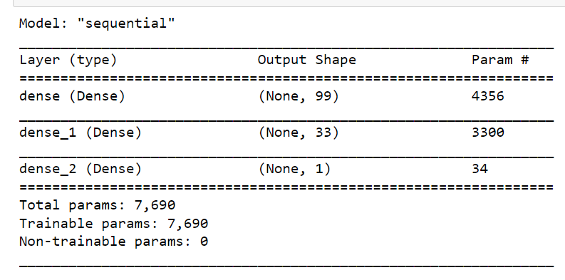
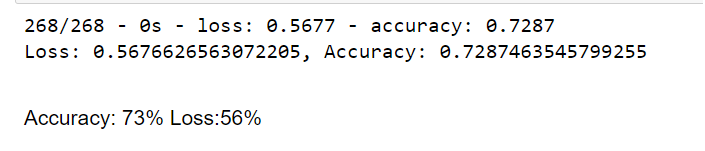
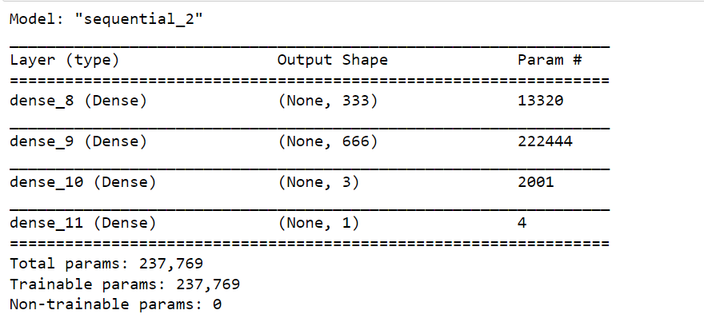
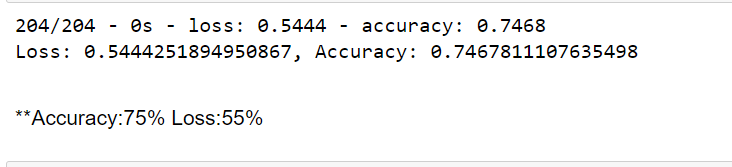

# Charity_Funding_Predictor

Using Machine learning and neural networks  to create a binary classifier that can predict whether applicants will be successful if funded
## Instructions

### Step 1: Preprocess the Data
Using your knowledge of Pandas and scikit-learn’s StandardScaler(), you’ll need to preprocess the dataset. This step prepares you for Step 2, where you'll compile, train, and evaluate the neural network model.
Using the information we have provided in the starter code, follow the instructions to complete the preprocessing steps.

Read in the charity_data.csv to a Pandas DataFrame, and be sure to identify the following in your dataset:

What variable(s) are the target(s) for your model?
What variable(s) are the feature(s) for your model?

Drop the EIN and NAME columns.

Determine the number of unique values for each column.

For columns that have more than 10 unique values, determine the number of data points for each unique value.

Use the number of data points for each unique value to pick a cutoff point to bin "rare" categorical variables together in a new value, Other, and then check if the binning was successful.

Use pd.get_dummies() to encode categorical variables.

### Step 2: Compile, Train, and Evaluate the Model
Using your knowledge of TensorFlow, you’ll design a neural network, or deep learning model, to create a binary classification model that can predict if an Alphabet Soup–funded organization will be successful based on the features in the dataset. You’ll need to think about how many inputs there are before determining the number of neurons and layers in your model. Once you’ve completed that step, you’ll compile, train, and evaluate your binary classification model to calculate the model’s loss and accuracy.

Continue using the Jupyter Notebook in which you performed the preprocessing steps from Step 1.

Create a neural network model by assigning the number of input features and nodes for each layer using TensorFlow and Keras.

Create the first hidden layer and choose an appropriate activation function.

If necessary, add a second hidden layer with an appropriate activation function.

Create an output layer with an appropriate activation function.

Check the structure of the model.

Compile and train the model.

Create a callback that saves the model's weights every five epochs.

Evaluate the model using the test data to determine the loss and accuracy.

Save and export your results to an HDF5 file. Name the file AlphabetSoupCharity.h5.

### Step 3: Optimize the Model
Using your knowledge of TensorFlow, optimize your model to achieve a target predictive accuracy higher than 75%.
Use any or all of the following methods to optimize your model:

Adjust the input data to ensure that no variables or outliers are causing confusion in the model, such as:

Dropping more or fewer columns.
Creating more bins for rare occurrences in columns.
Increasing or decreasing the number of values for each bin.

Add more neurons to a hidden layer.
Add more hidden layers.
Use different activation functions for the hidden layers.
Add or reduce the number of epochs to the training regimen.

## Report on the Neural Network Model
The purpose of creating these NN models was to find a tool that could help select applicants for funding. After the first model was created, I tried a few optimization models to see if I could improve accuracy while maintaining a low loss rate
without optimization

Accuracy: 73%
Loss:56%

with optimization:

